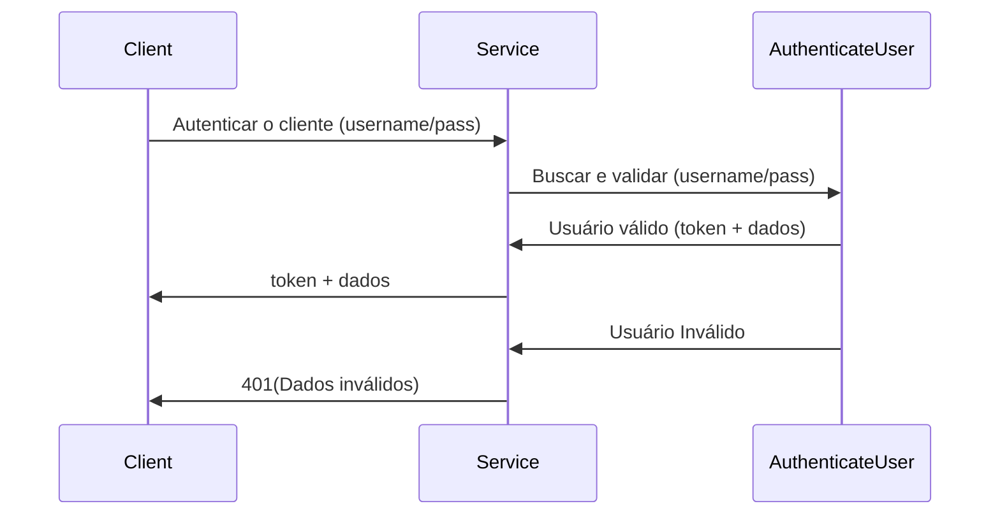
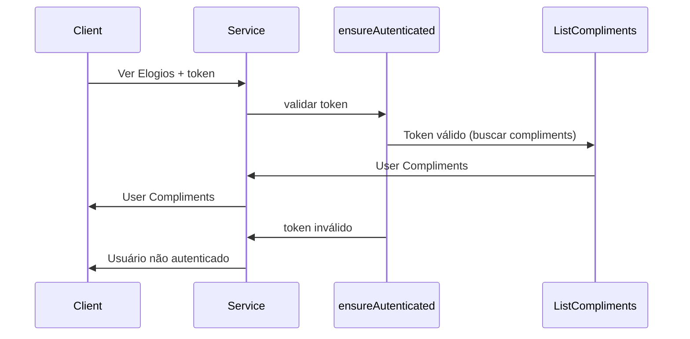

# Uma API REST Para Cadastro De Elogios

## Index

- [Usuários](#User-Usuário)
- [Tags](#tags)
- [Elogios](#Compliments-Elogios)

## User-Usuário

---

Essa API permite o cadastro de usuário. Quando um novo usuário é cadastrado é possível fazer login através de autenticação por token. Essa API permite ter usuário Admin e usuário padrão. Apena os usuários que são Admin podem criar novas Tags e cadastrar novos Compliments/Elogios.

Como regra de de negócio, não é permitido cadastrar usuários sem email e não é permito o cadastro de mais de 1 usuário com o mesmo email.

## Tags

---

As Tags são usadas para cadastrar novos Compliments/Elogios. Elas representam uma qualidade de uma pessoa, exemplo de tags: “inteligente”, “curioso”, “divertido”, dentre outras.

O Cadastro de Tags tem como regras de negócios: não é permitido cadastrar tag sem nome, não é permitido cadastrar mais de uma tag como o mesmo nome, não é permitido o cadastro de tags por usuários que não sejam Admin.

## Compliments-Elogios
---

Os Compliments, ou em português Elogios, são criados quando um usuário define uma Tag para outro Usuários. Além da Tag e o ID do Usuário, é possível enviar uma mensagem junto com o Elogio.

O Elogio tem relação com a entidade Tag e com a entidade Usuário. Um Elogio pode ter uma única Tag relacionada a ele, e uma Tag pode ter vários Elogios relacionados a ela (1:N). Um Usuário pode cadastrar vários Elogios, porém cada Elogio tem apenas um Usuário relacionado a ele (1:N).

## Autenticação

Autenticação do usuário é feita passando o username e senha, e retorna um token de autenticação. Esse token de autenticação é válido por 1 dia e você pode usar ele para acessar outros recursos da aplicação. 

Uma vez que o Client tem um token válido ele consegue usar em outros recurso. A válidação desse token é feita atrvés de um Middleware AuthenticatedUser. Esse faz

## REST

A característica REST da nossa aplicação facilita na escalabilidade, sistema em camadas (Uso de middleawares) e conseguir se adaptar a todo tipo de Client - o que também aumenta muita a escalabilidade. 

As desvantagens de ser REST é ter que enviar tokens de autenticação toda vez que precisamos certificar que um usuário está autenticado ou autorizar um usuário. Essa aplicação não guarda a informação de que um usuário está ou não autenticado.

## Stack

**Stack**: TypeScript, Node.js, SQLite, TypeORM.

## Features

- Configuração e Instalação inicial - instação de biblioteca, configuração de banco de dados e iniciando aplicação. [passo a passo](passo-a-passo/configuracao-inicial.md)
- Create user - Entidade user e métodos responsáveis por criar um novo usuário. [passo a passo](passo-a-passo/create-user.md)
